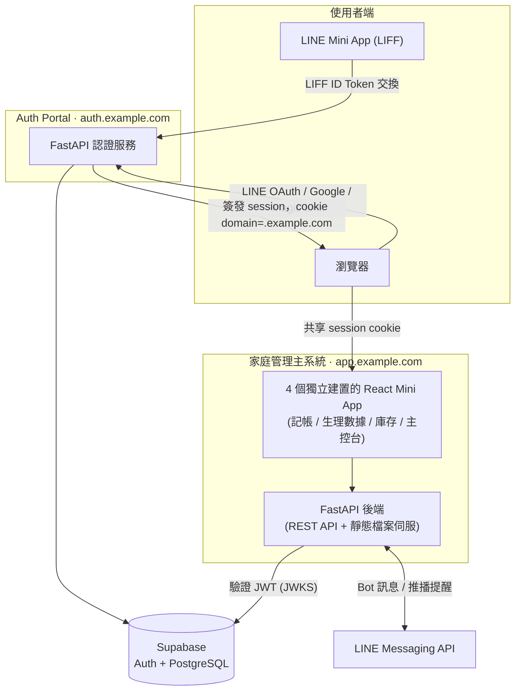
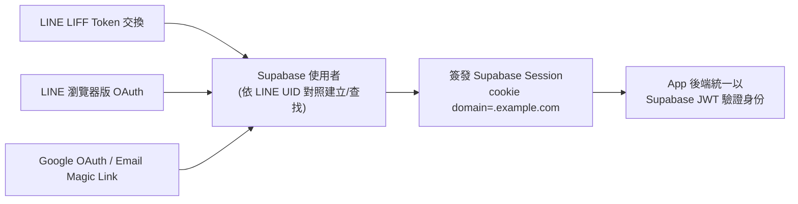
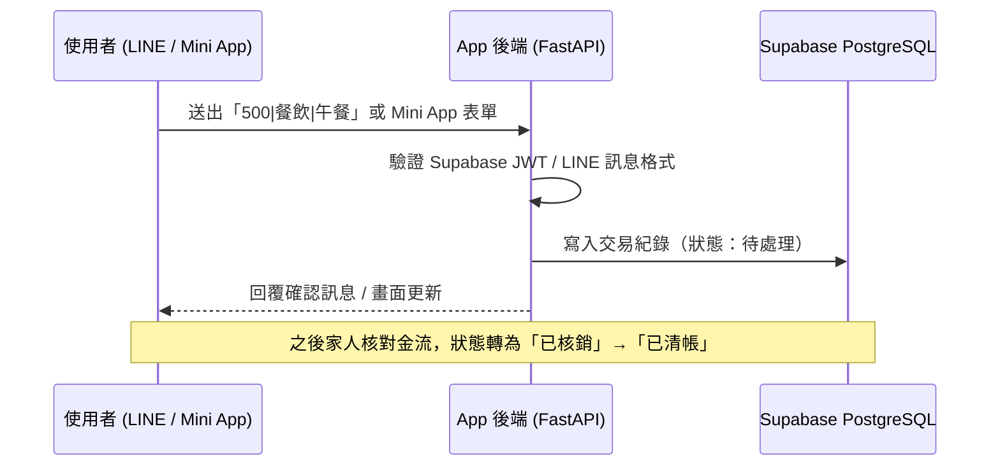

# Architecture

> 網域名稱、服務代號均為佔位符，不對應任何真實環境。

## 整體架構

## 三合一登入收斂流程

## 資料流：一筆記帳如何被記錄與統計

## 說明

- Auth Portal 與家庭管理主系統是兩個各自獨立部署的服務，各自有自己的 FastAPI 進程與資料庫連線，但共用同一個 Supabase 專案作為認證與資料的單一事實來源。
- 兩服務之間唯一的耦合點是「Supabase session cookie 的網域設定」與「JWT 驗證邏輯」，沒有額外的 token 轉發 API 或 session 同步機制，降低了跨服務通訊的複雜度。
- 家庭管理主系統內的四個 Mini App 各自是獨立的前端建置產物，但共用同一個後端 API 與同一份 JWT 驗證邏輯，只是依權限分級（見 [snippets/auth-jwt-middleware.py](snippets/auth-jwt-middleware.py)）決定各自能存取哪些模組。
